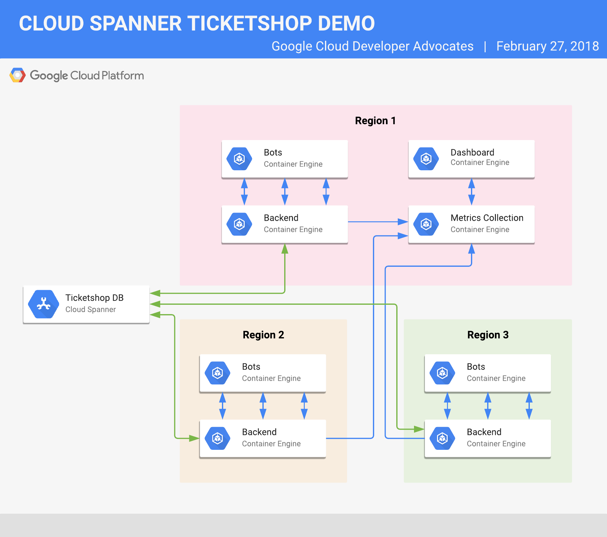
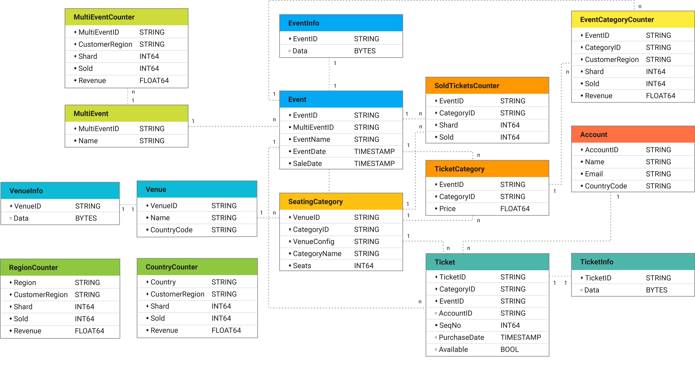

# Cloud Spanner Ticketshop Demo

## What this repository contains

This repository provides the source code for the Cloud Spanner Ticketshop Demo
shown first at Google Cloud NEXT 2017. It consists of 4 main applications:
(1) A tool for DB creation, schema creation and data loading found in the
[dataloadgenerator](dataloadgenerator/README.md) folder, (2) a Ticketshop
Backend serving a RESTful api found in the [backend](backend/README.md)
folder, (3) a Ticketshop BuyBot to simulate ticket purchasing found in the
[buybots](buybots/README.md) folder, and (4) the Ticketshop Dashboard
application to show ticket selling statistics found in the
[dashboard](dashboard/README.md) folder.

All 4 apps can be packaged in containers and run / managed in
[Kubernetes](https://kubernetes.io). Instructions how to run them can be found
in the README's in the respective folders.

## Architecture & Database Schema

High level architecture:


The DB schema used for this demo can be found in
[dataloadgenerator/schema](dataloadgenerator/schema/ticketshop-schema.sql):


## One script setup

A one-script setup is provided for this demo. The prerequisites are an Ubuntu
Google Compute Engine (GCE) instance with the following packages pre-installed
(see instructions below for a quick way to setup up a controller instance):

* apt-transport-https
* ca-certificates
* curl
* software-properties-common
* build-essential
* tmux
* git
* docker-engine

### Setting up the demo controller instance

To create an instance in your account and pre-install all required packages you
can run the commands below.

**Important**: Make sure your gcloud auth & project set correctly. You can
adjust the zone to create the GCE instance in with your preference.

**WARNING**: The below instructions create a service account with IAM permission
admin rights. If you don't want this, you can't use the one-script demo setup
and need to set it up manually. Please refer to the setup.sh for guidance.
You can remove the projectIamAdmin role from the service account after running
the setup script.

```bash
gcloud services enable container.googleapis.com
gcloud services enable compute.googleapis.com
gcloud services enable spanner.googleapis.com
gcloud services enable containerregistry.googleapis.com
gcloud services enable cloudresourcemanager.googleapis.com
gcloud services enable iam.googleapis.com

gcloud iam service-accounts create spanner-demo-gce-svc-acc \
--display-name "Cloud Spanner Demo GCE Service Account"

PROJECT=`gcloud config get-value project 2> /dev/null`; gcloud projects \
add-iam-policy-binding $PROJECT --member \
serviceAccount:spanner-demo-gce-svc-acc@$PROJECT.iam.gserviceaccount.com \
--role roles/resourcemanager.projectIamAdmin

PROJECT=`gcloud config get-value project 2> /dev/null`; gcloud compute \
instances create demo-controller-01 --zone europe-west1-c --machine-type \
n1-standard-1 --scopes "https://www.googleapis.com/auth/cloud-platform" \
--image-project ubuntu-os-cloud --image-family ubuntu-1804-lts --service-account \
spanner-demo-gce-svc-acc@$PROJECT.iam.gserviceaccount.com

gcloud compute scp scripts/setup-demo-controller.sh \
demo-controller-01:setup-demo-controller.sh --zone europe-west1-c

gcloud compute ssh demo-controller-01 --zone europe-west1-c \
--command "sudo sh setup-demo-controller.sh"
```

### Running the demo setup script

After setting up your instance you can ssh into your instance through
`SSH-in-the-browser` or with `gcloud`. **Elevate to sudo** with `sudo su -`
after successfully connecting to your instance.

Since the dataload is a long running process we run the script in `tmux`, you
can also use `screen`, to avoid having the process killed after an accidental
disconnect from your ssh session.

To create a tmux session run `tmux`. You can reconnect to your running tmux
session with `tmux a`.

```bash
sudo su -
tmux
```

In tmux you can now move into the repository folder
`cloudspanner-ticketshop-demo` and run `.scripts/setup.sh`.
Follow the instructions of the setup script.

Example Answers:

```bash
...
Please select a config for the Spanner instance.
1) regional-asia-east1
2) regional-europe-west1
3) regional-us-central1
Your choice: 2
Spanner Instance config set to 'regional-europe-west1'

Spanner Instance Name (min 6 chars): spanner-eu
Spanner Instance name set to 'spanner-eu'

DB Name: demo
Database name set to 'demo'

Please select a size for the demo DB.
1) 100GB
2) 1TB
3) 10TB
4) 20TB
Your choice: 1
```

You can run the demo after the dataload + setup of kubernetes clusters has
finished.

### Optional - remove admin and editor rights from service account

```bash
PROJECT=`gcloud config get-value project 2> /dev/null`; gcloud projects \
remove-iam-policy-binding $PROJECT --member \
serviceAccount:spanner-demo-gce-svc-acc@$PROJECT.iam.gserviceaccount.com \
--role roles/resourcemanager.projectIamAdmin
PROJECT=`gcloud config get-value project 2> /dev/null`; gcloud projects \
remove-iam-policy-binding $PROJECT --member \
serviceAccount:spanner-demo-gce-svc-acc@$PROJECT.iam.gserviceaccount.com \
--role roles/spanner.admin
PROJECT=`gcloud config get-value project 2> /dev/null`; gcloud projects \
remove-iam-policy-binding $PROJECT --member \
serviceAccount:spanner-demo-gce-svc-acc@$PROJECT.iam.gserviceaccount.com \
--role roles/container.admin
PROJECT=`gcloud config get-value project 2> /dev/null`; gcloud projects \
remove-iam-policy-binding $PROJECT --member \
serviceAccount:spanner-demo-gce-svc-acc@$PROJECT.iam.gserviceaccount.com \
--role roles/iam.serviceAccountAdmin
PROJECT=`gcloud config get-value project 2> /dev/null`; gcloud projects \
remove-iam-policy-binding $PROJECT --member \
serviceAccount:spanner-demo-gce-svc-acc@$PROJECT.iam.gserviceaccount.com \
--role roles/iam.serviceAccountKeyAdmin
PROJECT=`gcloud config get-value project 2> /dev/null`; gcloud projects \
remove-iam-policy-binding $PROJECT --member \
serviceAccount:spanner-demo-gce-svc-acc@$PROJECT.iam.gserviceaccount.com \
--role roles/storage.admin
```

## Controlling the demo

To control the demo you use the [buybots_scale.sh](scripts/buybots_scale.sh)
script.

To scale to 5 buybots per region run:

```bash
scripts/buybots_scale.sh 1 5
```

To stop the demo, run:

```bash
scripts/buybots_scale.sh 1 0
```

## Accessing the dashboard

The dashboard is exposed via a kubernetes service with an external IP.
To find the external ip you need to check the services in your main cluster.
The main cluster depends on the region you deployed your Cloud Spanner instance
to.
If you deployed to Europe, your main cluster context is `spannerdemo-europe-01`,
if you deployed to Asia, your main cluster context is `spannerdemo-asia-01`,
if you deployed to US, your main cluster context is `spannerdemo-us-01`.

To get the external ip for the dashboard service run:

```bash
kubectl --context {{MAIN_CLUSTER_CONTEXT}} get svc
```

For Europe:

```bash
kubectl --context spannerdemo-europe-01 get svc
```

The dashboard is hosted via HTTP. Navigate your browser to
`http://{{IP_OF_SPANNERDEMO_DASHBOARD_SERVICE}}`.

## Resetting sold tickets

To reset sold tickets you can run the reset job. Run this from the primary
region you selected in the setup script. Stop all buybots first.

Look for the latest generated reset job config in `k8sgenerated`, e.g.
`2018-02-27_1922-spannerdemo-reset-job-spanner-eu-demo-9b50595.yaml`.

```bash
kubectl --context spannerdemo-europe-01  create -f \
k8sgenerated/2018-02-27_1922-spannerdemo-reset-job-spanner-eu-demo-9b50595.yaml
```

After the job has finished, you can check with
`kubectl --context spannerdemo-europe-01 get jobs`, you need to delete the
job and reset the dashboard.

```bash
kubectl --context spannerdemo-europe-01 delete job spannerdemo-reset
kubectl --context spannerdemo-europe-01 delete pod \
spannerdemo-backend-influxdb-...
kubectl --context spannerdemo-europe-01 delete pod spannerdemo-dashboard-...
```

Deleting the influxdb and dashboard pods resets the metrics. They get
automatically restarted by their respective replicasets.

## Troubleshooting

If something goes wrong the best is to start from fresh.

 1. Remove the generated service account and assigned IAM permissions
 (`serviceAccount:$instancename-$db@$project.iam.gserviceaccount.com`)
 1. delete the created Kubernetes Clusters
 1. delete the Cloud Spanner Instance

## Development

## Prerequisite to run a container on GCE

Build the container and push to
[Google Cloud Container Registry](https://cloud.google.com/container-registry/)
with `make push-gcr`.

Create a GCE instance selecting CoreOS stable.
Make sure to give the instance API access to the required APIs.
Required APIs: Cloud Spanner API

Login to the GCE instance and authenticate docker to access the private
registry:

```bash
gcloud auth application-default print-access-token
docker login -u oauth2accesstoken -p "<TOKEN_OUTPUT_OF_PREVIOUS_CMD>" \
https://gcr.io
```

## Contributing

See [CONTRIBUTING.md](CONTRIBUTING.md)

## License

Copyright 2018 Google Inc. All Rights Reserved.

Licensed under the Apache License, Version 2.0 (the "License");
you may not use this file except in compliance with the License.
You may obtain a copy of the License at

     http://www.apache.org/licenses/LICENSE-2.0

Unless required by applicable law or agreed to in writing, software
distributed under the License is distributed on an "AS IS" BASIS,
WITHOUT WARRANTIES OR CONDITIONS OF ANY KIND, either express or implied.
See the License for the specific language governing permissions and
limitations under the License.

*This is not an official Google product*
